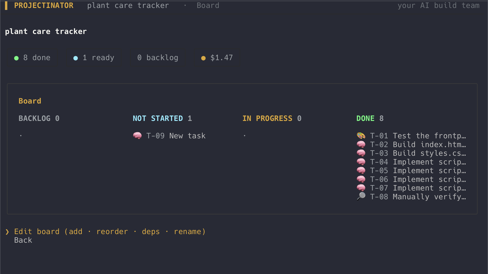

<p align="center">
  
</p>

# Projectinator

[](https://www.npmjs.com/package/projectinator)


**You're the PM. Your dev team is a roster of AI models.** Hand Projectinator an idea; a
project-manager model breaks it into a Scrum backlog, and each task is dispatched to the
model that's best — and cheapest — for that exact job (planning, design, code, test). You
watch it happen from a terminal cockpit: a live board, budget bar, and a standup.

<p align="center">
  
</p>

Built on the [Pi](https://pi.dev) agent harness (Node/TypeScript). Bring your own API key.

**Install & run** (Node ≥ 20):

```bash
npx projectinator                 # run without installing
# or
npm install -g projectinator      # then just: projectinator
```

> **It's a CLI, not a library.** `npm install projectinator` (without `-g`) only drops it into a
> project's `node_modules` — it won't create a runnable command. Use `npx projectinator` or
> `npm install -g projectinator`. (If `-g` installs but the command isn't found, npm's global
> bin dir isn't on your `PATH` — run `npm prefix -g` to locate it, or just use `npx`.)

Then, inside the app: **Settings → API keys** and paste an Anthropic, OpenAI, or Gemini key
(stored under `~/.projectinator`, never in the repo). That's it — pick **New build** and go.

<details>
<summary>Run from source instead</summary>

```bash
git clone https://github.com/smanookian/projectinator && cd projectinator
npm install
npm start
```
</details>

> **Optional:** `npx playwright install chromium` lets the tester actually run web apps in a
> headless browser and enables live preview. Everything else works without it.

> Projectinator spends **your** API money. Every screen shows the running cost; you set a
> budget cap and it halts before crossing it. A tiny landing page is cents; a full app is
> usually a dollar or two.

---

## What it does

Type an idea → it plans → you approve → it builds, tests, and hands you working files.

- **Best model per role.** Roles bind to a *capability + tier*, never a model name. A
  swappable registry maps capabilities to models — new frontier model next month, edit one
  place, every route updates. Run a **bake-off** to pick empirically.
- **A real pipeline.** PM decomposes → Designer specs → Developer writes files → Tester
  **runs the app headless and catches real bugs** → feedback loop re-runs the dev on failure.
- **Multi-file apps.** Vanilla HTML/CSS/JS or **React (CDN, no build)** — your choice.
- **The cockpit.** A polished terminal UI: editable board, Kanban, standup, per-task cost,
  live budget bar, desktop notification when done.
- **Honest cost.** Live spend tracking, per-project budget cap + an alert before the cap,
  and predicted-vs-actual reporting that sharpens itself over real runs.

## Highlights

| | |
|---|---|
| 🧠 **PM intake** | Vague request? The PM asks 2–4 clarifying questions (with pickable options) before planning. Specific requests skip straight through. |
| 🏛 **Deep plan (council)** | Opt-in: architect + product + risk leads propose epics in parallel, a synthesizer merges them, you approve, then they expand into the backlog. |
| 🆚 **Model bake-off** | Run one task across models, an LLM judge scores the outputs, compare cost/latency/quality — save the winner to the registry. |
| 🧪 **Real test execution** | The tester loads the built app in headless Chromium and fails on JS/console errors — not just by reading the code. |
| 👁 **Live preview** | Local server + auto-reload; ES modules and fetch resolve like production. |
| 🚀 **Deploy** | One click to Cloudflare Pages, Vercel, or Netlify (their CLI + your login). |
| 📤 **Export** | Backlog → Markdown, CSV, **Jira** CSV, **Trello** CSV. |
| 📜 **Git per build** | The workspace is a git repo; one commit per task. History view + **undo a task**. |
| 📊 **Analytics** | Retro (with optional AI narrative), burndown, cost by epic/model, and estimate accuracy that self-calibrates from real runs. |
| 💾 **Templates** | Save a project's brief as a reusable template; import/share as a file. |

## How it works

```
idea
 └─ stack?      pick platform + framework (or a saved default)
 └─ intake?     PM asks clarifying questions if the request is vague
 └─ plan mode?  Quick (one PM) or Deep (planning council → approve epics)
 └─ decompose   → a routed, epic-tagged backlog with a cost estimate
 └─ approve     → auto-run, or gate the backlog / gate again before dev
 └─ build       toposort deps · design → code → test · Tester→Dev feedback loop
 └─ done        working files + retro + deploy/export/preview
```

Each task runs on a real Pi session; Pi reports its own token usage and dollar cost, so
"actual" cost is authoritative. Estimates live in code (models are bad at guessing their own
token use) and **self-calibrate** from measured runs.

## Examples

Real, unedited output from a full build, kept in [`examples/`](examples/):

- **[Tip calculator](examples/tip-calculator/)** — PM → design → 3× code → test, $0.46,
  tester PASS. Three separate files (`index.html`, `styles.css`, `app.js`) that run on
  double-click (`file://`) *and* over http — the regression artifact for the
  ["runs on double-click" guarantee](#good-to-know).

## CLI (same engine, for scripting/CI)

```bash
npm start                                         # the cockpit (the normal way to use it)
npm run build -- --live --mini                    # cheap end-to-end proof (~$0.10)
npm run build -- --live --lock anthropic "idea"   # full pipeline on one provider
npm run build -- --live --mini --resume           # resume a halted/finished build (skips done tasks)
npm run bakeoff -- --capability design "Design a pricing page"   # model bake-off
npm test                                          # 134 tests
npm run typecheck
```

## Configuration & data

- **Keys** are stored at `~/.projectinator/config.json` (chmod 0600) — never in the repo.
- **Settings** (in the app): API keys, preferred provider, default workflow, default stack,
  model assignments, budget cap + alert %, estimate accuracy.
- **User data** lives under `~/.projectinator/` (config, calibration, templates, exports).
  Each build gets its own git-versioned workspace folder (one commit per finished task).

## Good to know

- **It spends your API money.** The cost tracking is honest; keep it visible.
- **Web-login is experimental and parked.** Driving your paid ChatGPT/Claude/Gemini *web*
  subscriptions violates those providers' ToS and risks your account — vendors actively
  enforce this. It is hidden behind `PROJECTINATOR_WEB=1` and should stay that way. Use the
  API-key path.
- **React = CDN, no build step** (runs by opening `index.html`). Vite/npm builds and
  mobile/desktop toolchains are future work.

## License

MIT — see [LICENSE](LICENSE). © 2026 Stepan Manookian.

## Roadmap

See [`TODO.md`](./TODO.md). Internal architecture + how-to: [`docs/INTERNAL.md`](./docs/INTERNAL.md).
